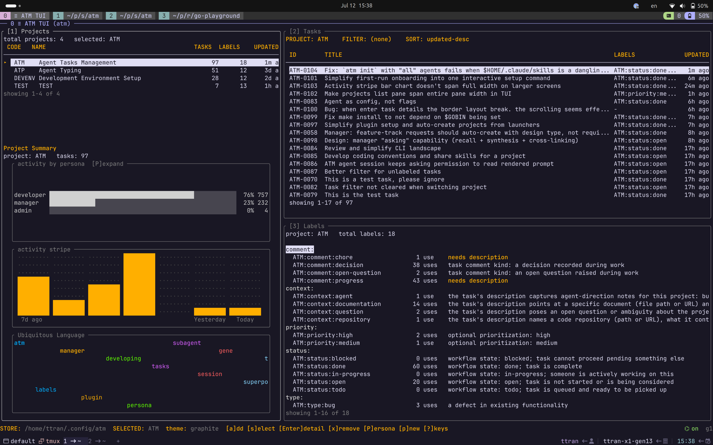
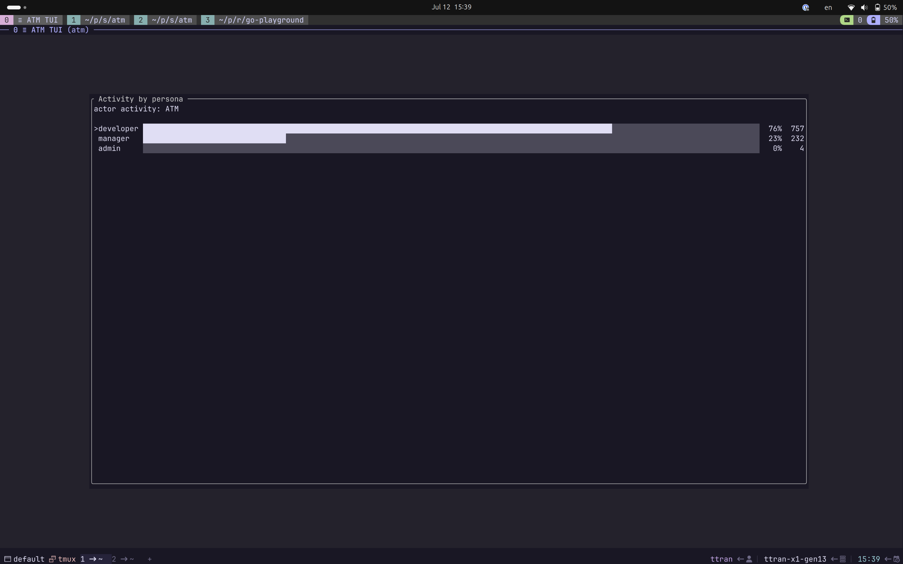
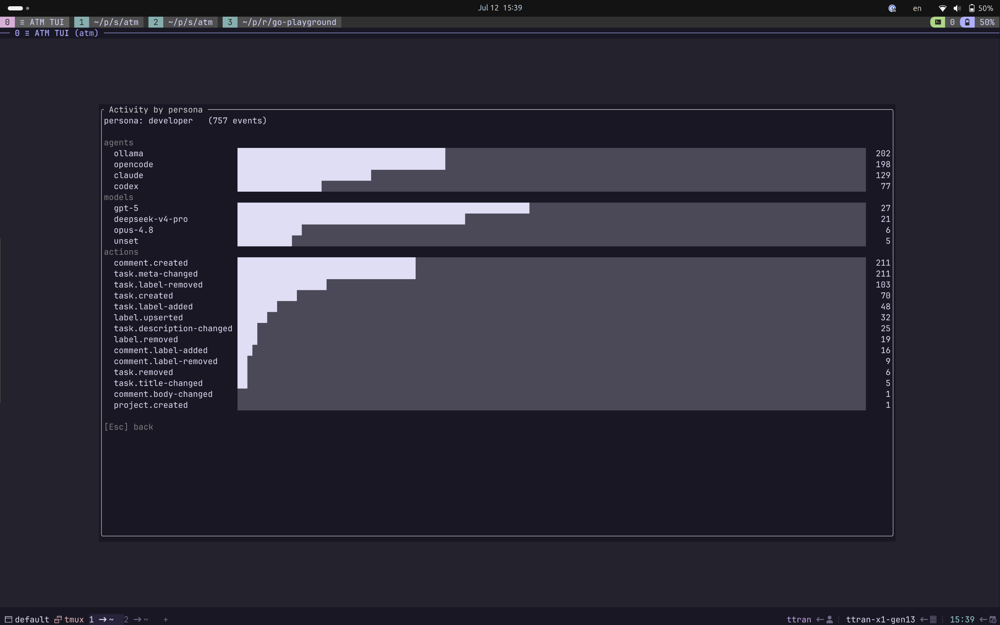

# ATM — Agent Tasks Manager

ATM is a fast, scalable, distributed task ledger — git-like in how it stores truth, Jira-like in how it tells the story — built as the main interface through which coding agents keep a software organization's knowledge base.

## 30-Second Start

**1. Install** the `atm` binary:

```sh
curl -fsSL https://raw.githubusercontent.com/TranDuongTu/atm/main/scripts/install.sh | bash
```

**2. Initialize, then map your repos.** Run the guided setup once — it initializes the store, installs the agent plugins, and records your default agent and args. Then create a project and let the manager map each working repo into it:

```sh
atm init                                # once: store, agent plugins, default agent + args
atm project create --code ATM --name "Agent Tasks Management"
atm manage --project ATM --mapping      # inside each working repo: manager-assisted mapping
```

Mapping reconciles the project's context map against the repo: the manager discovers the territory, records context pointers, and verifies drifted ones on later runs. Semantic indexing is optional — see [Advanced Features](#advanced-features).

**3. Daily work.** Open the dashboard to see everything, start dev sessions in repo directories, and run manager actions to keep the ledger groomed:

```sh
atm                            # dashboard: tasks, projects, labels, activity

atm dev --project ATM          # developer session (run inside the working repo)
atm dev --project ATM --agent claude

atm manage --project ATM                # curate the backlog (default action)
atm manage --project ATM --recall       # answer project questions from the ledger (read-only)
atm manage --project ATM --mapping      # reconcile the context map against the repo
```

## The Story

### What You Can Try Today

- Work across multiple projects at once, including projects that span several repositories.
- Switch coding agents freely to manage cost, context, and tokens — the ledger, not the agent, holds the state.
- Resume or hand off work between agents with minimal re-briefing.
- Move between machines: the store is an append-only ledger that is portable and shareable by copy.
- Skip ticket UIs built for human browsing — ask your agents, and they work from the ledger.
- Keep ideas flowing into the backlog anytime, anywhere, and let the manager groom and plan them later.

### The Grand Vision

Whether the future belongs to AI or to humans, software has to remain soft to stay useful — and it stays soft only while the intent behind it stays legible. Software has always been where an organization accumulates its lessons and scales them, and for decades human engineers kept that knowledge base alive with more than languages and IDEs: git preserved every decision as history, while Jira boards and a sprawl of docs carried the narrative of where the system goes next. A senior engineer often works those tools more than they write code.

Agentic coding has changed the interface between the developer and the software. You rarely write your own PRs or commits, you no longer read the tracker line by line, and you juggle more worktrees than you ever imagined — you manage intentions more than you manage code. Git honestly tells you the current truth and the whole history behind it, but not the road ahead. The road ahead lives in Jira, Notion, Quip, Google Docs — mutable surfaces where every edit overwrites the last, keeping the current plan but losing the growth, the decisions, and the awareness that produced it. Putting an MCP server in front of them gives agents access, not a fit.

As the world turns agentic, your main working interface becomes a single terminal where you talk to your own agents — and agents forget. Sessions end, context windows die, models get swapped for cost; the knowledge has to survive all of it. So ATM gives your intentions the storage discipline git gave your code: an append-only, plain-file, mergeable ledger that agents journal into as they work, recall from when they return, and hand off through when they change — and the one window through which you stay oriented while they do the writing.

ATM replaces none of those tools — it is the hub beneath them. The same append-only design that lets replicas of the ledger converge through a shared folder or a git remote lets adapters mirror it out to a Jira board, a Notion page, a doc your manager actually reads — and contribute knowledge back in to enrich them. Those surfaces stay what they are good at: views for humans. The ledger stays what they never were: the memory.

## Screenshots



Dashboard view with project-level activity, task lists, label vocabulary, and recent work density.



Persona activity overview for seeing how developer, manager, and admin work is distributed.



Persona drilldown with agent, model, and action breakdowns.

## Store

ATM keeps everything as plain files under `ATM_HOME` (default `~/.config/atm`), so a whole store is portable by directory copy. A project is not the same thing as a repository; one project can cover multiple repos.

Each project is a **distributed event source**: an append-only stream of events — task created, title changed, label added — that is the single source of truth. Event ids are content hashes, and every event carries a hybrid-logical-clock stamp and a replica id, so independent replicas of a project merge deterministically: a sync is an exact set union of the two event sets. Everything you query is a *derived* projection of that log — `cache.db` and the vector index rebuild from the events on demand, and deleting them never loses data.

```text
$ATM_HOME/
  store.json               # replica id + HLC clock, active format, per-project formats
  cache.db                 # derived SQLite projection — rebuildable, never the source of truth
  projects/<CODE>/
    events.v2.jsonl        # the source of truth: one event per line, append-only
    config.json            # per-project settings: embedding endpoint, sync remotes
    vectors/ vocabulary.json log.jsonl   # derived index, computed vocabulary, preserved v1 log
```

### Sync And Remotes

Remotes are named, per-project, and replica-local — a remote describes *this replica's* route to the world, exactly like `.git/config`. A remote is a passive medium: a directory (a NAS mount, a Syncthing or Dropbox folder, a USB stick) or a git URL; the transport is selected from the URL shape.

```sh
atm store remote add origin git@github.com:you/atm-ledger.git --project ATM
atm store remote list --project ATM

atm store sync                            # every project with a remote, bidirectional
atm store sync --project ATM --pull       # restrict direction with --pull / --push
atm store sync <url> --project ATM        # ad-hoc remote — nothing persisted
atm store sync --project ATM --dry-run    # fetch, validate, report the differences; commit nothing
```

Because sync is set union — commutative, associative, idempotent — any topology converges, and every failure's recovery is "run sync again": an interrupted sync leaves both stores valid, and the next one completes the difference. Fetched events are validated before anything touches the local store (every hash recomputed, parents resolved, DAG acyclic, same project root on both sides), so a corrupt or mismatched remote aborts the whole sync with the local store untouched.

There is no separate clone verb: `atm store sync <url> --project <CODE>` for a project you don't hold locally fetches it, creates it, and persists the URL as its `origin` — the second machine is one command.

### Upgrade To v2

```sh
atm store upgrade --all      # upgrade every project; new projects are born on v2 afterward
atm store verify
```

Upgrade builds each project's `events.v2.jsonl` from its existing `log.jsonl`, verifies the two agree, and cuts over; the v1 log is left untouched, so a failed upgrade changes nothing. Add `--project <CODE>` to upgrade one project without changing the store default. Existing ids are kept (`ATM-0001` stays `ATM-0001`); new tasks and comments get hash ids like `ATM-9f3c1a`.

## Build And Verify

```sh
make build
make test
make verify
```

## Advanced Features

These features are optional after the 30-second start. They are useful when you want tighter control over vocabulary, semantic search, or agent roles.

### Labels And Boards

Labels are the substrate: free-form, namespaced names (`status:open`, `type:bug`, `sprint:next`) with no fixed workflow fields — each project grows its own vocabulary, and `atm label list --project <CODE>` shows the live one.

A **board** is a label whose membership is computed by an expression over other labels, not asserted task-by-task. Author one with `atm label add --expr`:

```sh
atm label add --project ATM \
  --name ATM:next-sprint \
  --description "open work slated for the next sprint" \
  --expr "status:open AND sprint:next"
```

A board name is a valid `--label` value, so listing its members reads like any other query:

```sh
atm task list --project ATM --label ATM:next-sprint
```

The Boards pane in the TUI is the human's review surface for boards and namespaces.

### Semantic Search And Indexing

Semantic search needs an embedding endpoint and a vector index.

**1. Configure the embedding model.** Use any OpenAI-compatible `/v1/embeddings` endpoint:

```sh
atm project set-embedding --project ATM \
  --model nomic-embed-text \
  --endpoint http://localhost:11434/v1 \
  --dim 768 \
  --threshold 0.55
```

**2. Build and inspect the index from the CLI.**

```sh
atm index reindex --project ATM      # one-shot index pass
atm index status --project ATM       # staleness per indexed model
atm index models --project ATM       # models with stored vectors
atm search --project ATM "query"     # semantic search with text fallback

atm index --project ATM              # continuous foreground indexing until Ctrl-C
```

**3. Or manage indexing from the TUI.** Run `atm`, then press `g 1` to open the indexer overlay: `e` edits embedding config (`p` fills the Nomic preset, `s` saves), `S` starts or stops the live indexer, `r` runs a one-shot reindex, `d` drops the selected model index.

### Personas And Agent Defaults

Personas shape the role prompt and actor identity used in `atm dev` and `atm manage`. ATM seeds three built-in personas: `developer` (default for `atm dev`), `manager` (default for `atm manage`), and `admin` (human-driven CLI/TUI actions).

Create a custom persona when you want a recurring working style, and use it for one session with `--persona`:

```sh
atm persona create \
  --name reviewer \
  --description "reviews implementation quality before handoff" \
  --prompt-file ./prompts/reviewer.md

atm dev --project ATM --persona reviewer
```

`atm init` records your default agent separately from personas. Use `atm agents` to inspect readiness, change the default host, or save default host-agent args; for one-off launches, override with `--agent` and pass host-agent args after `--`:

```sh
atm agents list
atm agents select claude
atm agents args claude -- --dangerously-skip-permission

atm dev --project ATM --agent codex -- --yolo
```

### Lower-Level API

The lower-level task, label, project, store, search, index, persona, and activity commands remain available for agents and scripts. Discover them with:

```sh
atm help
atm conventions
```
