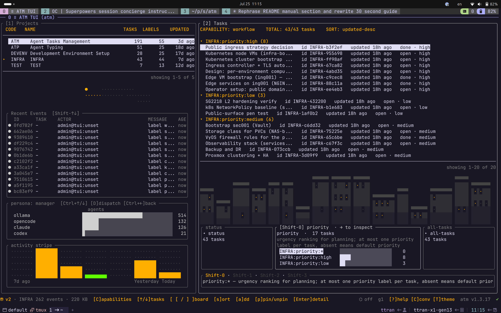
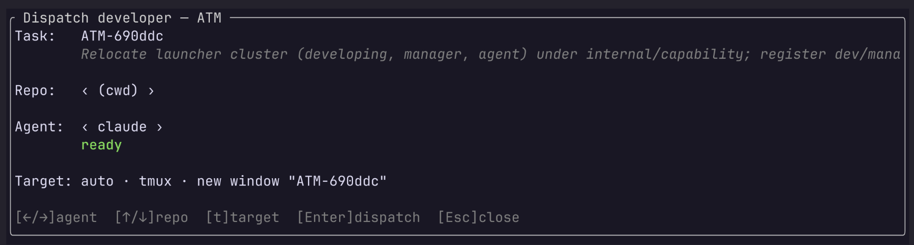
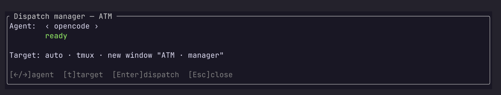
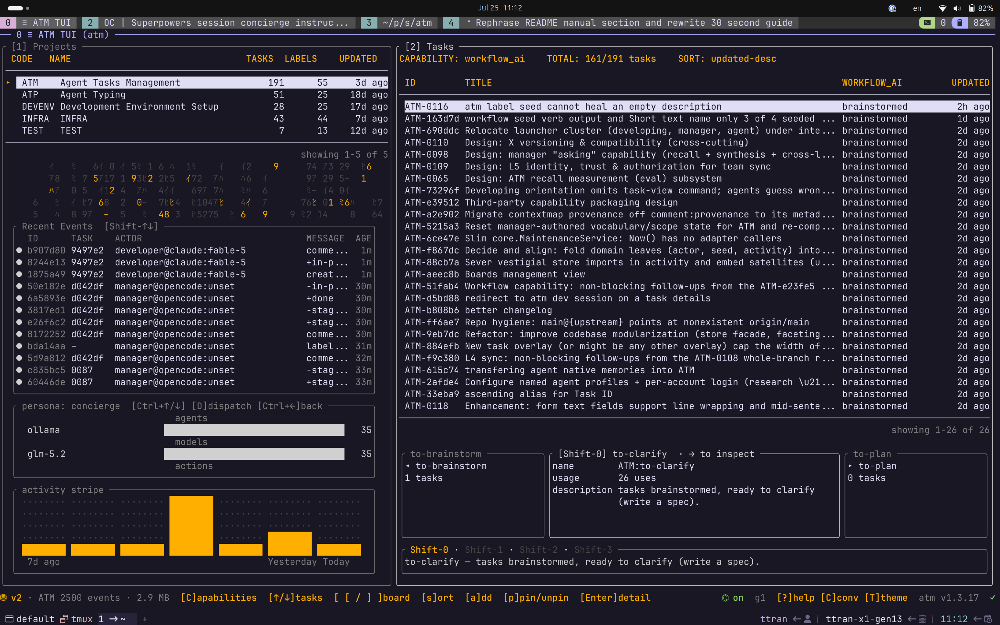

# ATM — Agent Tasks Manager

ATM is a fast, scalable, distributed task ledger — git-like in how it stores truth, Jira-like in how it tells the story — built as the main interface through which coding agents keep a software organization's knowledge base.

## Why I Build This

These days I spend most of my time in terminals navigating AI agents. I write less code and spend more time managing and sharing my ideas and intentions. As a long-time lover of tools like nvim, tmux, and lazygit, I built a TUI that acts as a command center: I drop in my ideas, and a team of agents helps me organize, brainstorm, challenge, and dispatch to get the jobs done for me:

- I can switch between projects and repositories in seconds and dispatch a manager agent to brief me on where things stand and what comes next.
- I can share one coding agent's progress and context with others — challenge one agent's output with another, hand off mid-conversation, or route each task to the agent that fits it best (Claude is slow on most tasks but very good at planning, for example).
- I can work with different types of agents — `claude`, `codex`, `opencode`, or ollama-driven variants running local models — all launched the same way, picked per dispatch: plan with one, implement with another, keep cheap local models on the grunt work. The ledger, not the agent, holds the context, so switching costs nothing.
- I can dispatch a coding agent onto a selected task without explaining the context again. The agents are also instrumental in keeping the discipline: journal as you code, and orient on the latest state of the world before generating anything.
- I can dispatch a manager agent to proactively organize the knowledge tracked in the ledger and keep it consistent, so that over time my agents and I stay synced on the same brain.
- I can (creatively) add personas or capabilities to harness my process further, because the system at its core is just a single log datastore and two entities — a record and its labels. Every other logic is governed by prompts and carried entirely by agent intelligence.

As for the logs, think of ATM as a git-like tool: you own your logs locally and sync them to a remote host (GitHub, GitLab, ...). Your knowledge stays fully yours, yet you can still learn from (merge) others' and share your own. Where it is unlike git: ATM also tracks your future directions, not just what has already happened in your codebase.

## 30-Second Start

**1. Install** the `atm` binary:

```sh
curl -fsSL https://raw.githubusercontent.com/TranDuongTu/atm/main/scripts/install.sh | bash
```

Later, upgrade the installed binary in place:

```sh
atm update
```

**2. Initialize** once — this creates the store, installs the agent plugins, and checks which host agents (claude, codex, ...) are ready, recording your default agent and args:

```sh
atm init                                 # once: store, agent plugins, default agent + args
```

**3. Start the TUI** — everything else happens inside it:

```sh
atm
```

The whole loop is select-and-dispatch — you pick a row, press `D`, and an agent session does the work:

- **Get ready**: press `W` for the setup & readiness wizard — which harnesses are ready, which of this project's channels each one can reach, which starter checklists are missing, and the fix for each, one key away (see "Setup And Readiness" below). A store with no projects opens on it; a status-line `⚠ setup [W]` says when something is unready.
- **Onboard**: press `D` anywhere to open the dispatch dialog, press `p` to cycle to **concierge**, and dispatch a plain-language onboarding session that creates your project, enables the right capabilities, and seeds their vocabulary.
- **Autopilot**: select a project, press `D` (it preselects **manager**), and dispatch a session that grooms the backlog, converges the enabled capabilities, and briefs you on what's next.
- **Work a task**: select a task and press `D` to dispatch a **developer** session bound to it — no re-explaining the context. Cycle the persona with `p`, the host agent with `←/→`, the repo to spawn into with `↑/↓`, the spawn target with `t` (herdr pane, tmux window, or terminal tab), then `Enter` launches it.
- **Explore**: `V` browses personas; `\` opens the spotlight — a horizontal launcher grouped by Project/Task/Board/Reference, drill in with `Enter`, search by typing, hover a row for a live preview (see "The Spotlight" below).

## Screenshots



Dashboard view: projects with recent events and persona activity on the left, tasks grouped by the active capability on the right, and the pinned-board strip below.



The universal dispatch dialog: pick a persona with `p`, an agent with `←/→`, a repo with `↑/↓` (when a project is in scope), a spawn target with `t`, then `Enter` launches it.



Dispatching a manager session for the selected project.



Persona drilldown (here: concierge) with agent, model, and action breakdowns — `D` dispatches a session for the drilled persona.

## Store

Each project stores its truth as an append-only event log — portable, mergeable, and rebuildable. Sync is a deterministic set union of event sets; any topology converges, and every failure's recovery is "run sync again."

```text
$ATM_HOME/
  store.json
  cache.db                 # derived SQLite projection — rebuildable from events
  projects/<CODE>/
    events.v2.jsonl        # source of truth: one event per line, append-only
    config.json            # per-project settings
```

### Remotes and Sync

Add a filesystem remote first — a directory on a shared drive or a sync folder:

```sh
mkdir -p ~/Sync/atm
atm store remote add origin ~/Sync/atm --project ATM
# Git remotes also work:
atm store remote add origin git@github.com:you/atm-ledger.git --project ATM
```

Sync in either direction; the default is bidirectional:

```sh
atm store sync                            # every project with a remote
atm store sync --project ATM --pull       # pull-only
atm store sync --project ATM --dry-run    # preview differences
```

Bootstrapping a project from its canonical remote is a one-liner: `atm store sync <url> --project <CODE>` fetches, creates it locally, and persists the URL as `origin`. A git remote needs at least one commit to exist first — seed it with `git commit --allow-empty`.

### Legacy v1 Import

v2 is the only current format. A pre-v2 `log.jsonl` can be imported:

```sh
atm store upgrade --project <CODE>
atm store verify
atm store prune-v1 --project <CODE>
```

Upgrade is side-by-side: the original `log.jsonl` is never touched during import, and `prune-v1` archives it by default (or `--delete`s it). There is no rollback.

## Build And Verify

```sh
make build
make test
make verify
```

## Advanced Features

These features are optional after the 30-second start. They are useful when you want tighter control over vocabulary, semantic search, or agent roles.

### Labels And Boards

**Labels** are the substrate everything builds on — free-form, namespaced names (`status:open`, `priority:high`, `context:agent`) with no fixed workflow fields. Each project grows its own vocabulary, visible with `atm label list --project <CODE>`. Labels come in three kinds:

- **Stored labels** — directly assigned to tasks (`ATM:type:bug`, `ATM:component:cli`).
- **Namespace labels** — emergent from task use; a wildcard like `ATM:status:*` matches any task carrying a `status:*` label, and the TUI groups by namespace for faceted browsing.
- **Boards** — computed labels whose membership is defined by a boolean expression over other labels, not asserted task-by-task.

A **board** is authored with `--expr`:

```sh
atm label add --project ATM \
  --name ATM:next-sprint \
  --description "open work slated for the next sprint" \
  --expr "status:open AND sprint:next"
```

A board name is a valid `--label` value, so listing its members reads like any other query:

```sh
atm task list --project ATM --label ATM:next-sprint
```

**Capabilities build on the label substrate.** Four built-in capabilities ship with ATM and mount their own boards, verbs, and vocabulary:

| Capability | Verbs | Namespaces | Seeded Boards |
|-----------|-------|------------|---------------|
| `workflow` | `start`, `open`, `block`, `complete`, `status` | `status:*`, `priority:*` | `backlog`, `open-tasks`, `in-progress-tasks`, `all-tasks` |
| `contextmap` | `add`, `stamp`, `retarget`, `supersede`, `check` | `context:*`, `knowledge:*` | `context-current` |
| `channel` | `add`, `list`, `show`, `edit`, `remove`, `wire`, `stamp`, `migrate-repos` | `channel:*` | `channels` |
| `checklist` | `list`, `show`, `add`, `edit`, `remove` | `checklist:*` | `checklists` |

Session contexts render a `## Capabilities` block: every enabled capability's one-line brief, sourced from its own guide frontmatter. The checklist capability stores named, per-persona standing operating procedures behind `atm checklist`, with seeded concierge starter checklists.

Enable capabilities per project and scope manager actions to one:

```sh
atm project capability add workflow --project ATM
atm --persona manager --project ATM --mode autopilot --capability workflow
```

Each capability ships a self-contained agent guide — read it to understand its semantics, actions, and converged state:

```sh
atm capability workflow guide
atm capability contextmap guide
atm capability list                     # summaries for every registered capability
```

The Boards pane in the TUI is the human's review surface for boards and namespaces, with a pinned-board strip, per-namespace drilldown, and live board-editor feedback.

### Semantic Search And Indexing

Semantic search needs an embedding endpoint and a vector index.

**1. Make the embedding model available.** ATM speaks any OpenAI-compatible `/v1/embeddings` endpoint. The common case is a local Ollama daemon — install Ollama, then pull an embed model before configuring ATM, or the indexer will fail with `model "..." not found`:

```sh
ollama pull nomic-embed-text        # default Nomic preset; 768-dim
# alternates, if nomic-embed-text is unavailable on your Ollama:
# ollama pull bge-m3                # 1024-dim
# ollama pull mxbai-embed-large     # 1024-dim
```

Hosted OpenAI-compatible providers (OpenAI, LocalAI, vLLM, etc.) need no pull step — just an API key and a reachable `/v1/embeddings` URL.

**2. Configure the embedding model.** Point ATM at the endpoint you just stood up:

```sh
atm project set-embedding --project ATM \
  --model nomic-embed-text \
  --endpoint http://localhost:11434/v1 \
  --dim 768 \
  --threshold 0.55
```

Match `--model` and `--dim` to the model you pulled. A 404 `model "..." not found` from the embed step means the named model is not present at the endpoint — pull it (Ollama) or fix the model name/provider.

**3. Build and inspect the index from the CLI.**

```sh
atm index reindex --project ATM      # one-shot index pass
atm index status --project ATM       # staleness per indexed model
atm index models --project ATM       # models with stored vectors
atm search --project ATM "query"     # semantic search with text fallback

atm index --project ATM              # continuous foreground indexing until Ctrl-C
```

**4. Or manage indexing from the TUI.** Run `atm`, then press `g 1` to open the indexer overlay: `e` edits embedding config (`p` fills the Nomic preset, `s` saves), `S` starts or stops the live indexer, `r` runs a one-shot reindex, `d` drops the selected model index.

### Personas And Agent Defaults

Personas shape the role prompt and actor identity used in `atm --persona <name> --project <CODE>`. ATM ships three built-in personas: `developer` (the default developer persona), `manager` (the default manager persona), and `admin` (human-driven CLI/TUI actions), plus `concierge` (plain-language onboarding, launchable without `--project`). Built-ins ship inside the binary from the top-level `skills/` folder and are no longer seeded into the store; inspect one with `atm persona show <name>` and customize it with `atm persona personality <name>`.

Create a custom persona when you want a recurring working style, and use it for one session with `--persona`:

```sh
atm persona create \
  --name reviewer \
  --description "reviews implementation quality before handoff" \
  --prompt-file ./prompts/reviewer.md

atm --persona developer --project ATM --persona reviewer
```

`atm init` records your default agent separately from personas. Use `atm agents` to inspect readiness, change the default host, or save default host-agent args; for one-off launches, override with `--agent` and pass host-agent args after `--`:

```sh
atm agents list
atm agents select claude
atm agents select ollama:claude --model qwen3:8b
atm agents models opencode
atm agents args claude -- --dangerously-skip-permission

atm --persona developer --project ATM --agent codex -- --yolo
```

A selection is **agent × launcher × model**. The agent is the harness
(`claude`, `codex`, `opencode`); the launcher is who starts it — the harness
itself, or `ollama` serving a local model to it, which is why `ollama` is a
launcher rather than an agent (whether the `ollama` binary is installed is one
fact, not one per harness). `agents list` renders that as a row per agent and a
column per launcher, with `*` on the selected cell.

The model is stored per selection key, so `claude` and `ollama:claude` keep
separate models. **Leaving it empty is a real choice**: it means the harness
picks its own default, which ATM does not know and does not invent — such a
session stamps its ledger writes as `developer@claude:unset`. Set one and the
actor becomes truthful (`developer@ollama:qwen3:8b`). `atm agents models
<name>` lists what the launcher can serve where the launcher has a list verb
(`ollama list`, `opencode models`); `claude` and `codex` have none, so their
model names are typed by hand.

### Setup And Readiness (`W`)

`W` opens the **setup & readiness wizard** from any pane. It is a full-screen
view rather than an overlay — it replaces the workspace and keeps the status
line — and it answers one question: what is ready, and what is the fix for
what is not. `Tab` cycles the sections, `↑/↓` move within one, `Enter` drills
into the focused section and `Esc` peels the drill before closing the view,
`r` re-probes, and `Esc` on the top level closes it.

**AGENTS** is always there: a row per harness with a readiness glyph — `●`
ready, `◐` fixable right here, `○` the fix is outside ATM (ATM can install its
own plugin for a harness, but it cannot install the harness) — plus the
installed version, the plugin state, which launchers can start it, its model,
and how many of the scoped project's channels it covers (the optional columns
drop from the right as the terminal narrows; the glyph and the agent name never
do). **CHANNELS** and
**PERSONAS** appear only when a project is in scope; with none selected the
wizard is honestly global and those sections are absent rather than empty.

The view opens instantly and fills in. Everything reachable without a
subprocess — PATH lookups, plugin files on disk, the stored selection, the
project's channels and checklists — is on screen immediately; the cells that
cost a `--version` or an `mcp list` per harness (1.6–3s each) render as `…`
until their probe lands, so a pending answer never reads as a known-empty one.

Each section carries its own fix ladder, advertised in the footer:

| Section | Keys |
| --- | --- |
| AGENTS | `i` install ATM's plugin · `d` make this the default agent · `m` set its model · `a` add this project's MCP servers via the harness's own `mcp add` · `l` authorize one (`mcp login`/`mcp auth`) · `u` run the harness's own update verb |
| CHANNELS | `w` wire this machine's path · `s` stamp it verified |
| PERSONAS | `e` enable the `checklist` capability · `s` author the shipped starter checklists this project is missing |
| Anywhere | `c` dispatch a concierge session, scoped to the section you are in |

Most of those are done by ATM itself and work with **no agent ready at all** —
which matters, because on a fresh store nothing is ready and the action that
ends that bootstrap (`i`) must not require what it is there to produce. The
three that need a terminal of their own — `l`, `u`, `c` — are handed to the
same dispatcher `D` uses; only the concierge waits for a ready agent. When
there is no dispatch target (no herdr, no tmux, no `terminal_cmd` — plausibly
the first-run case) ATM shows the literal command to paste instead of
dead-ending.

Two more places the wizard shows up on its own:

- **A store with no projects lands on it.** There is nothing else to show and
  nothing else to press, so the wizard *is* the TUI until an agent is ready,
  at which point it points at creating your first project. It never creates
  one itself.
- **The status line carries `⚠ setup [W]`** whenever any agent is unready —
  from the moment you launch, without ever opening the wizard, and it
  disappears entirely the moment nothing is unready.

The same picture is available headless, and never writes to the store:

```sh
atm setup status                          # agents only
atm setup status --project ATM            # + that project's channels and checklists
atm setup status --project ATM --output json
```

`--project` falls back to `ATM_PROJECT`, so a session already scoped to a
project gets the project sections without repeating the code.

Two things this surface will not do, in the TUI and in `setup status` alike:

- **Unknown is not missing.** Every fact is tri-state. A probe that could not
  answer — the harness is not installed, its verb failed, the call timed out,
  or its output did not parse — reports `unknown`, never `absent`. Reporting a
  timeout as "missing" would send you to fix something that is not broken, so
  the writes refuse too: `a` will not "repair" an MCP configuration ATM never
  managed to read. The rule cuts both ways: a harness that *answers* — "no MCP
  servers configured", or a server listed with no health to report — has told
  ATM something, and it is reported as what it is (`absent` for the first,
  `unknown` for the second) rather than collapsed into either extreme.
- **No "update available" claims.** ATM shows the version a harness reports
  and offers to run that harness's own update verb (`claude update`, `codex
  update`, `opencode upgrade`). It does not compare that against a latest
  release, because nothing available to it knows one without running the
  update — so it says what is installed and offers the action, and claims
  nothing more.

### Dispatching Sessions From The TUI

The TUI can spawn manager, developer, concierge, and admin sessions into a separate terminal surface. The spawn target is auto-detected (herdr pane → tmux window → new terminal tab, in that order), and `t` in the dispatch dialog cycles it by hand (`auto`, `herdr`, `tmux`, `terminal`). From the projects pane, `D` dispatches a **manager** session for the selected project — or, when the persona chart is drilled in, a session for the drilled persona (concierge and admin launch without a project). From the tasks pane, `D` dispatches a **developer** session bound to the selected task row. The host agent is an interactive field in every dialog (cycle with `←/→`, dispatch with `Enter`); an unready agent is refused with its missing-bin hint. The developer dialog adds one more field — the **repo** to spawn into (cycle with `↑/↓`), drawn from the project's wired repo channels (see Channels, below); when none are wired it falls back to the TUI's current directory. `V` opens a read-only **personas** browser (list built-ins and customs, `Enter` views a persona's effective prompt, `Esc` backs out); `E` opens a read-only **channels** overlay (every channel with its wiring and stamp status, `Enter` for detail, `Esc` backs out).

A developer session can equally be handed a task from the shell with the new
`--task <id>` flag — it is validated against `--project`'s store, exported to
the host as `ATM_TASK=<id>`, and rendered into the session context as an
assigned-task block (so it works identically for `launch: hook` and
`launch: prompt` personas, and task-keyed context caches prevent concurrent
task sessions from sharing a context file):

```sh
atm --persona developer --project ATM --agent claude --task ATM-4b7e24
```

### The Spotlight (`\`)

`\` opens the spotlight from any pane — a horizontal launcher: a left action list and a right full-height preview. Its root shows four groups plus a few inline global actions:

- **▤ Project** — create, select, rename, dispatch, remove.
- **☰ Task** — add a task, or search one to act on it.
- **▦ Board** — author boards and labels, pin jump slots, seed the enabled capabilities' vocabulary.
- **§ Reference** — the keymap reference, the CLI↔TUI parity table, and the conventions primer.
- Inline: dispatch `[D]`, channels `[E]`, personas `[V]`, capabilities `[C]` (once a project is scoped), cycle theme `[T]` — the bracketed keys are the real TUI bindings each row documents; inside the spotlight they type into the search, and `Enter` on the row is what runs them.

`↑/↓` move the cursor, `Enter` drills into a group (or a task's own action menu), `Esc` peels back one level at a time, and `\` closes the spotlight from any level. `Tab` swaps focus to the preview pane — from there, arrows or `j`/`k` scroll it a line and `pgup`/`pgdn` a screenful (both page keys also work without switching focus). Everything else you type filters: a non-empty query flattens the visible list into ranked `Group · Label` matches — at the root, inside a group, or among a task's own actions — and a query with no hits shows a `no matches` hint.

The **Task** group turns into a live search once a project is in scope: typing matches that project's tasks case-insensitively by ID and by title, ranks ID matches above title matches, and shows at most 5 results. Every task ID in a project shares that project's code prefix (e.g. `ATM-xxxxxx`), so a very short query that happens to appear in the prefix — a single letter, or a fragment like `at`/`tm` — matches every task in the project by ID alone and can fill the 5-result cap before any title match is even considered; that's the ID-substring rule doing exactly what it's meant to, not a search bug, so reach for a few characters from the title when you want a title match to surface. Hovering a result previews the task — its labels, description, and audit history; `Enter` opens a menu of six actions scoped to that one task (edit title, edit description, add/remove label, comment, remove) reachable from wherever you currently are in the app.

The spotlight replaced the earlier `[?]` contextual menu. Project detail's `H` history toggle is gone outright; task detail's `H` history overlay is gone too, but its content didn't disappear — it now renders inside the spotlight's Task-group preview. Project-detail capability toggling was also removed; the detail view keeps a read-only capabilities listing, and enabling/disabling now lives only in the `C` overlay.

### Channels

A channel is how personas communicate — a git repository, a Notion database, later other surfaces — recorded in three tiers: a ledger record (project code, unique `--name` handle, purpose, and a type-shaped address such as a repo's remote URL or a Notion workspace/database, synced across machines); this machine's local wiring (a repo's clone path and/or an MCP server name, kept only in `config.json`, never synced); and no third tier at all, because ATM never stores a token, password, or credential — authorization lives in the agent's own tooling (e.g. the Notion MCP server's OAuth store), and ATM only records that it happened via a stamp. `atm channel add/list/show/edit/remove` manage the ledger record, `atm channel wire` records this machine's path or MCP server, and `atm channel stamp` vouches that someone actually reached the channel just now:

```sh
atm channel add --project ATM --name atm --type repo --purpose "primary source tree" --url https://example.com/atm.git
atm channel wire --project ATM --name atm --path ~/projects/scyllas/atm
atm channel list --project ATM
atm channel stamp --project ATM --name atm --note "cloned and verified"
```

In the TUI, `E` opens a read-only **channels** overlay listing every channel with its status; all writes still go through `atm channel`. A project that recorded repos the old way (`atm project repo add`, now retired) lifts them in one shot with `atm channel migrate-repos --project <CODE>`, which reports three outcomes: `migrated` channels got both a ledger record and this machine's wiring (confirm each one's purpose with `atm channel edit`); `unwired` channels got a ledger record but their recorded local path no longer exists on this machine (re-wire with `atm channel wire` once you know where the repo lives now); `skipped` repos were left untouched in the legacy config because their name already belongs to a different, non-repo channel (nothing is lost — resolve the collision by renaming one side or wiring the legacy path onto a new handle). Channels are gated behind the `channel` capability: new projects get it automatically from the registry, but a project whose capability list was ever recorded explicitly (as ATM's own is) needs it enabled and seeded once, after which `atm channel` works normally: `atm project capability add --project <CODE> --name channel` then `atm capability channel seed --project <CODE>`.

When neither herdr nor tmux is present, the terminal fallback opens a new tab
in a known emulator (kitty, wezterm, gnome-terminal, konsole, alacritty,
foot). Override it by hand-editing `dispatch.json` at the store root
(sibling of `agents.json`) with a `terminal_cmd` template run via `sh -c` and
`{cmd}` (shell-quoted argv) / `{dir}` / `{title}` placeholders:

```json
{ "terminal_cmd": "kitty @ launch --type=tab --cwd {dir} --tab-title {title} -- {cmd}" }
```

### Lower-Level API

The lower-level task, label, project, store, search, index, persona, and activity commands remain available for agents and scripts. Discover them with:

```sh
atm help
atm conventions
```
